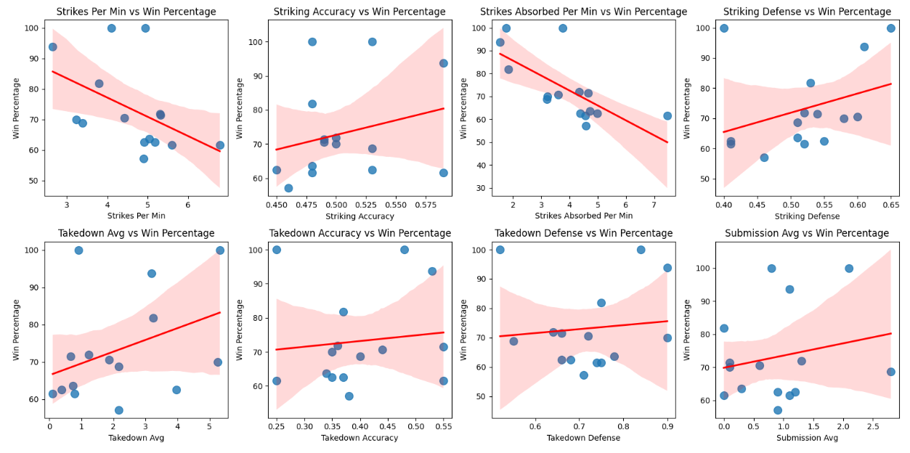
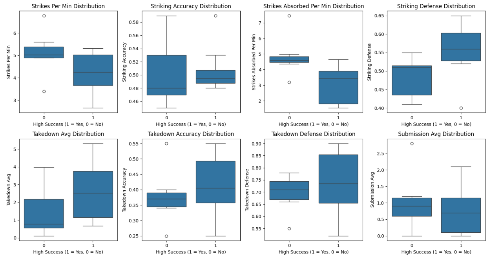
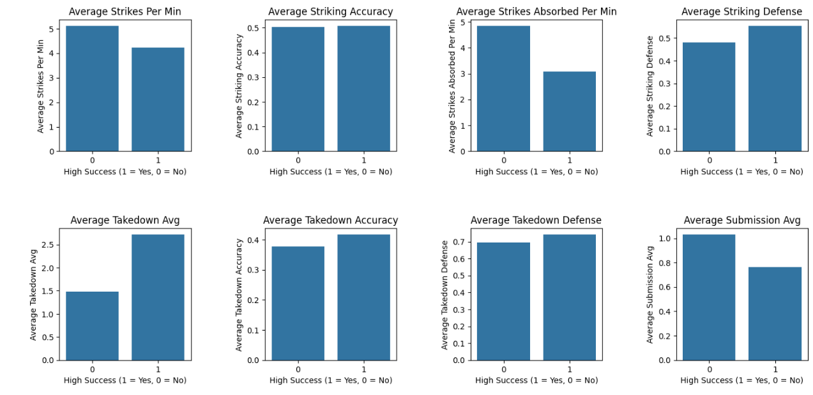
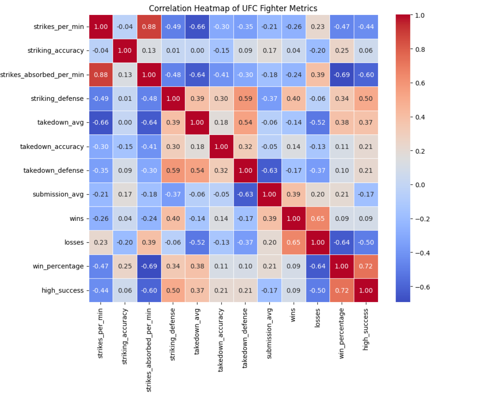
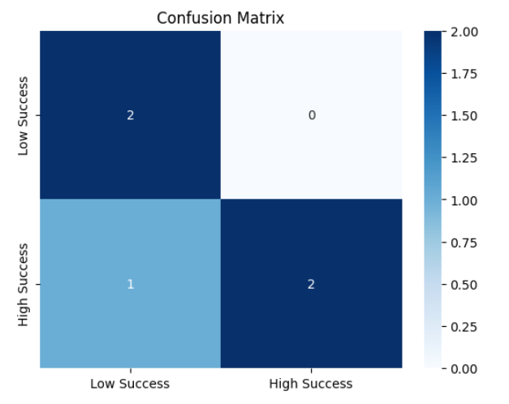
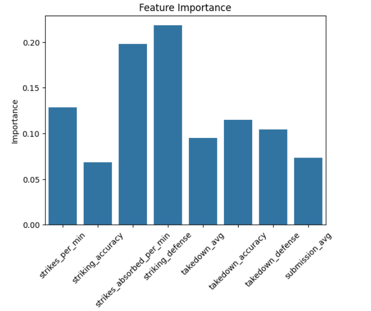

# UFC Fighter Metrics Analysis

This project provides an in-depth analysis of UFC fighter statistics, aiming to predict the success of a fighter based on key metrics. The project uses Python, data science libraries (like Pandas, Matplotlib, Seaborn, Scikit-learn), and machine learning models to analyse and predict a fighter's success rate.

## Table of Contents

- [Project Overview](#project-overview)
- [Data Preparation](#data-preparation)
- [Visualisations](#visualisations)
    - [Scatter Plots](#scatter-plots)
    - [Box Plots](#box-plots)
    - [Bar Plots](#bar-plots)
    - [Heatmap](#heatmap)
- [Findings](#findings)
- [Model Training](#model-training)
    - [Confusion Matrix](#confusion-matrix)
    - [Feature Importance](#feature-importance)
- [Unit Tests](#unit-tests)
- [Conclusion](#conclusion)
- [Installation](#installation)

## Project Overview

This project uses statistical data on UFC fighters, including metrics such as strikes per minute, takedown accuracy, and submission average. By applying machine learning models and visualisations, the goal is to determine which factors contribute most to a fighter's success and predict the success of future fighters.

The key steps include:
1. **Data preparation**: Cleaning and structuring the data.
2. **Exploratory data analysis**: Generating plots to understand the data better.
3. **Model training**: Training a model to predict the fighter's success based on the metrics.
4. **Unit testing**: Ensuring that the functions and models work as expected.

## Data Preparation

The data was cleaned and transformed for model readiness:
- The percentage columns like **striking_accuracy**, **striking_defense**, etc., were converted from strings (e.g., '50%') to floats.
- A **win_percentage** column was calculated based on the number of wins and losses for each fighter.
- Fighters were labelled with **high_success** (1 for high success, 0 for low success) based on a win percentage threshold of 70%.

## Visualisations

The following visualisations are included to understand the data and features better:

### Scatter Plots

Scatter plots were used to show the relationship between key fighter metrics and win percentage. Each plot includes a line of best fit to help visualise the trends.

#### Findings:
- **Strikes per minute**: Fighters with a higher strikes per minute tend to have higher win percentages, suggesting aggression plays a role in success.
- **Striking accuracy**: The correlation with win percentage is slightly positive, but not very strong. Accuracy seems to play a role, but other factors could be more significant.
- **Takedown accuracy** and **Takedown defense**: Both these metrics show a stronger relationship with win percentage. Fighters with higher takedown accuracy and better defense generally tend to have better success.



### Box Plots

Box plots display the distribution of metrics for fighters with high and low success, helping to understand the variations in the data.

#### Findings:
- Fighters with **high success** tend to have a wider range of values in metrics such as **strikes per minute**, **striking accuracy**, and **takedown avg**.
- Fighters with **low success** show more consistency in their metrics, especially in **striking accuracy** and **submission average**.



### Bar Plots

Bar plots were used to compare the average values of each metric for fighters classified as high or low success. These plots provide insights into how each metric contributes to a fighter's success.

#### Findings:
- **Strikes per minute**: Fighters with higher success tend to strike more frequently.
- **Striking accuracy** and **submission avg**: Fighters with low success tend to have lower values, while high-success fighters tend to have better stats.
- **Takedown accuracy and defense**: Fighters with high success are generally more proficient in these areas, confirming that defensive and offensive skills in grappling are essential for success.



### Heatmap

A heatmap was used to show the correlation between various fighter metrics, helping to identify relationships between features.

#### Findings:
- **Strikes per minute** has a moderate positive correlation with **strikes absorbed per minute**, implying that fighters who strike more also tend to absorb more.
- **Takedown accuracy** and **takedown defense** show a strong positive correlation, indicating that fighters who are good at defending takedowns also tend to have better takedown skills.
- **Win percentage** and **high success** show a high positive correlation, as expected.



## Findings

1. **Key Metrics for Success**: Strikes per minute, striking accuracy, takedown accuracy, and takedown defense appear to be the most important metrics for predicting high success in fighters.
2. **Defensive and Offensive Balance**: High-success fighters tend to have a balanced skillset in both offensive striking and defensive tactics, particularly in takedown accuracy and defense.
3. **Win Percentage Correlation**: Win percentage is directly related to high success, and our analysis confirms that fighters with better metrics across these areas tend to win more often.

## Model Training

A **Random Forest Classifier** model was trained to predict whether a fighter is of high or low success based on their metrics. The model was evaluated using a confusion matrix, and feature importance was plotted to identify the most influential metrics.

### Confusion Matrix

The confusion matrix was used to evaluate the performance of the classification model. It shows how well the model correctly classifies high and low success fighters.



#### Findings:
- The model shows a reasonably balanced classification of **low success** (2 correctly classified) and **high success** (2 correctly classified).
- Misclassifications occurred with one **high success** fighter being classified as **low success**.

### Feature Importance

This plot shows the importance of each metric in determining the fighter's success. **Strikes per minute**, **striking accuracy**, and **striking defense** were identified as the most significant features influencing success.



## Unit Tests

The project includes unit tests to validate the functionality of the data preparation and model training components. Tests include:

1. Verifying that the **win_percentage** calculation works correctly.
2. Ensuring that the **high_success** classification is accurate.
3. Testing that the model is trained successfully and can make predictions.

To run the tests, use the following command:

```bash
python -m unittest discover tests/
```

## Conclusion

The analysis of UFC fighter metrics reveals that certain metrics, such as **strikes per minute**, **striking accuracy**, and **takedown defense**, are highly correlated with a fighter's success. Machine learning models trained on these metrics show promising results in predicting a fighter's success rate. Future work could include expanding the dataset, incorporating additional metrics, and fine-tuning the machine learning models for better accuracy.